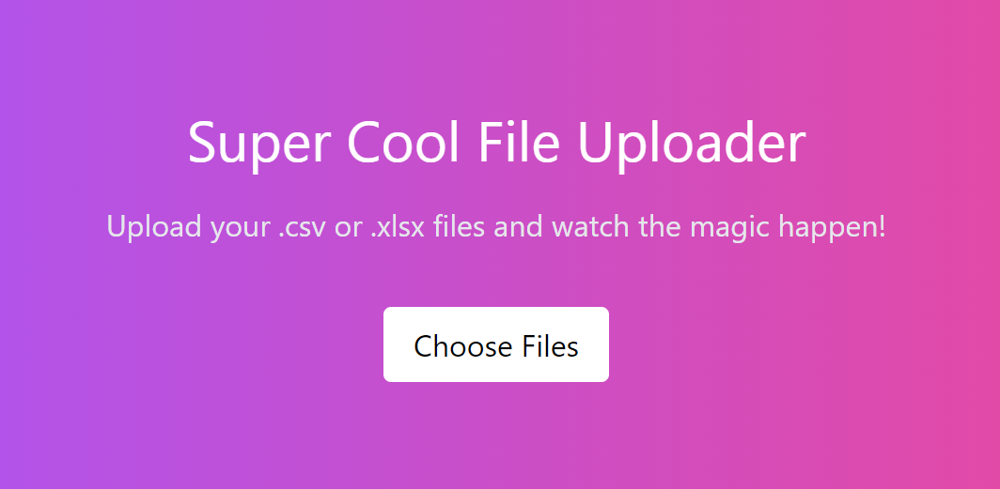

# Super Cool File Uploader

## Description
This project was created as part of a technical assessment for a job application. The task involved allowing a user to upload multiple files to an http server. The server would then store the files temporarily and kick off a separate worker thread to begin validating and processing the data files. The results are stored to a Postgres database.

## Quick Start

> Docker is a prerequisite to running this project. Please ensure you have [Docker](https://docker.com) installed before proceeding.

1. `git clone git@github.com:catdadcode/pdk-data-importer.git && cd pdk-data-importer`

2. `docker compose up`

That's it! The project should now be running on `http://localhost:3000`.

## Technologies Used
- Node.js
- TypeScript
- Express
- Postgres
- Docker
- TailwindCSS
- WebSockets
- Worker threads
- Prisma ORM

### Node.js + TypeScript
I spoke about my love for Bun but node is still the de facto standard and is used at PDK so I decided to stick with the tried and true method. However it is fun to note that Bun would have slimmed down a fair bit of boilerplate ;)

### Express
Express, in my opinion, may as well just have it's functionality rolled into node at this point 😂. It's so ubiquitous for anything REST related. I started off using it with the [Multer](https://www.npmjs.com/package/multer) middleware for uploading, but since I was already using WebSockets for realtime updates I decided it made sense to just establish a single pipe and use it for everything. Which basically means express is only used to serve the `index.html` file. A simple `http` server would do for that but I left express in there since it was already setup and would have been there had I needed it for anything else.

### Prisma ORM + Postgres
I wanted to show that I'm familiar with ORMs so I picked my favorite one, Prisma. Setting up a schema that can be easily updated and migrated without losing data is extremely useful and Prisma makes that super easy.

### Docker
I love Docker. It's so easy to setup and run a project in a container. It's also a great way to ensure that the project is running in the same environment as the one it was developed in. I've included a `compose.yml` file that will setup the project with a Postgres database and a Node.js server. For local development I simply mapped `postgres        127.0.0.1` in `/etc/hosts` within WSL and then run `docker compose up postgres` to only spin up the database container. This way I could run the app outside of Docker without modifying the connection string during development. When running `docker compose up` the app itself will also be containerized and utilize docker's default networking to connect to the database container.

### Worker Threads
One of the requirements stated that the file processing needed to be done in a separate process. It can actually be detrimental to spin up whole processes for simple tasks like this so I opted to use worker threads instead, which accomplish the same goal of ensuring the work done there doesn't not bog down the main event loop. A new worker thread is spun up for each file uploaded and is responsible for all file validation and processing. Updates are communicated back to the main thread and sent immediately to the client over the already established WebSocket connection.

### WebSockets
Since we needed to communicate back to the client with status updates it made sense to just go straight to a proper WebSocket. This we we have bidirectional communication for all of our needs. One unique challenge here is that there is no simple way to send metadata with a binary WebSocket message. This means that we have to send a JSON payload ahead of the binary data and ensure that we can associate those two messages together on the server without any race conditions due to additional uploads or other connected clients.

On the server side I had to establish a `lastFileName` variable at the socket connection level so the file name could be remembered by the time we receive the binary payload. However this is only half a solution as multiple metadata payloads will override this value. We have to also ensure that the messages are sent in the correct order. To do this the client script wraps both messages in a promise and waits for that promise to resolve before sending the next one.

### TailwindCSS
When I first looked at Tailwind I hated it. I thought it made markup messy looking. But after using it regularly I won't do CSS any other way if I have a choice. It's so fast to iterate with, especially for stuff like this where I'm not taking the time to setup a full blown front-end build pipeline. Just drop it in via CDN and you're off the the races!

## Future Improvements
Obviously this is a technical assessment that will not be revisited but I want to note a few things that I would have liked to do if I had more time.

### Unit Testing
I had planned to write unit tests that would ensure all the validation logic is robust and that the worker threads are functioning as expected. I was planning to use [Vitest](https://vitest.dev/) for this as it's my favorite testing framework thanks to its speed and simple API surface (Only beat out by Bun's built-in testing framework 😉).

### Error Handling
The error handling chain is pretty solid but there are a few places that could be spruced up. There are some asynchronous functions that get passed as callbacks and the invoking party isn't likely checking for a rejected promise, but also the logic being done in those places isn't likely to break and the most important bits do have proper try/catch wrappers. I just wanted to highlight that I am aware of caveats like this and another optimization pass or two would have been good for this project if it were a real thing.

Similarly the validation errors are just kind of shunted to the front-end as status update strings and could have been handled more robustly. I would have liked to have a more structured error response that could be sent back to the client and displayed in a more user-friendly way, but for now the most important thing was getting that feedback to the user.

### File Cleanup
Technically the `build/` directory is ephemeral and the nested `uploads/` directory gets cleaned up any time the app is rebuilt, but there should be an explicit cleanup step once all files have been processed. Not difficult, just wasn't top priority with the time constraints.

### Google Sheets
I was determined to get all the bonus points on the list but I did not get around to this one due to time. There are some pretty straightforward wrapper libraries that remove a lot of the boilerplate around Google's autogenerated SDKs. I likely would have gone with one of those solutions for interacting with Google Sheets. The quick and dirty solution was going to be just trying to read from a URL and expecting the user to have already made it public. However, the ideal solution would have been a proper OAuth implementation that allowed the user to authenticate with Google and grant our app permission to allow the user to access all their own sheets regardless of sharing settings.